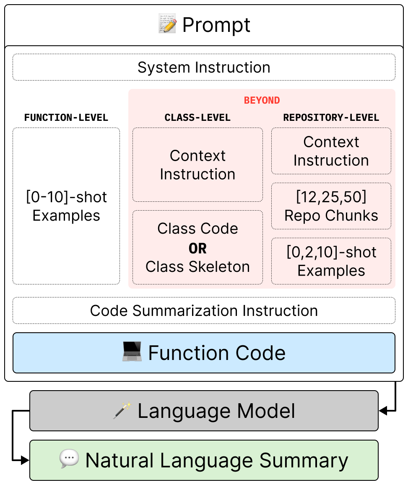
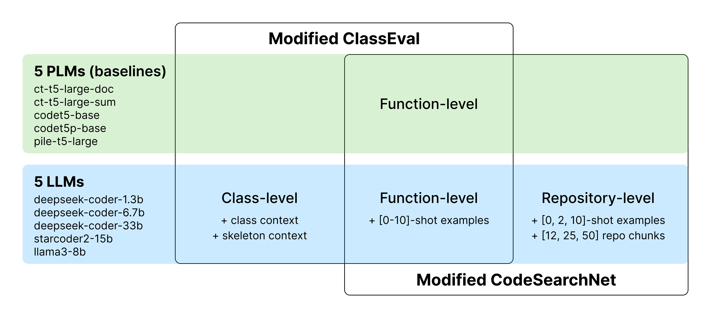
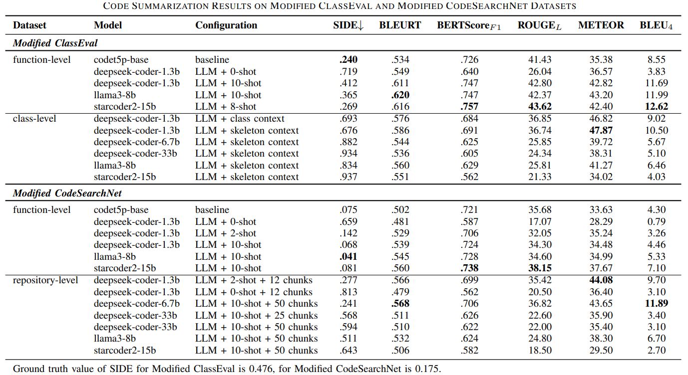
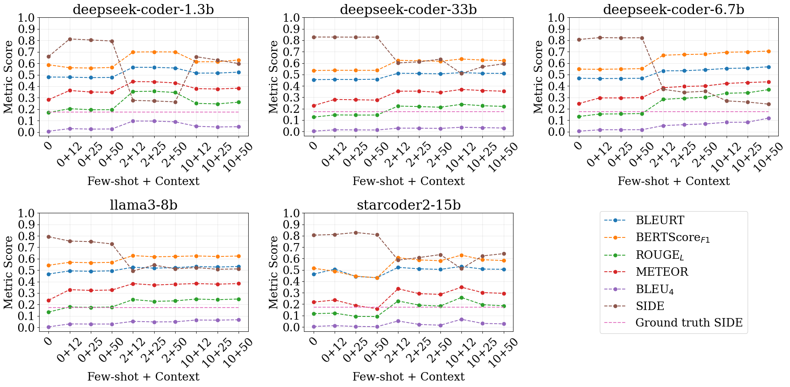
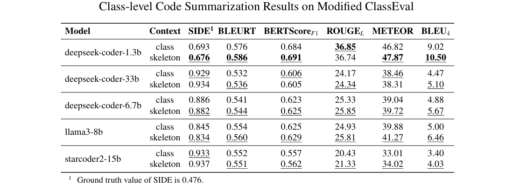
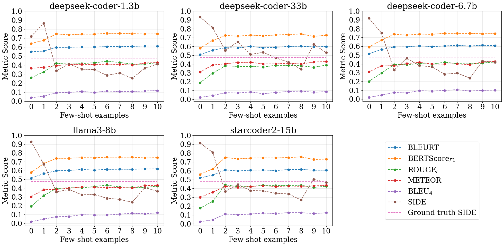
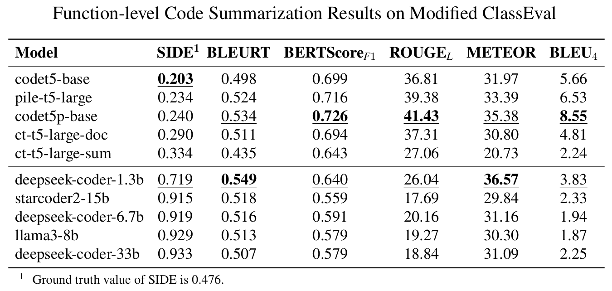
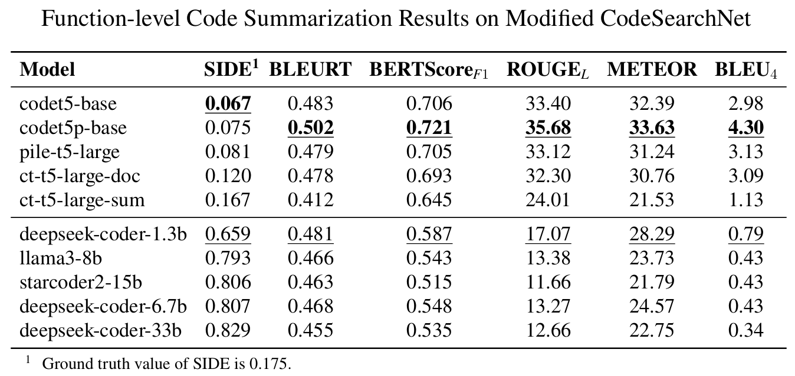

# Code Summarization Beyond Function Level (LLM4Code @ ICSE 2025)

This paper is accepted at [LLM4Code](https://llm4code.github.io) Workshop co-located with [ICSE 2025](https://conf.researchr.org/home/icse-2025).

> Code summarization is a critical task in natural language processing and software engineering, which aims to generate concise descriptions of source code. Recent advancements have improved the quality of these summaries, enhancing code readability and maintainability. However, the content of a repository or a class has not been considered in function code summarization. This study investigated the effectiveness of code summarization models beyond the function level, exploring the impact of class and repository contexts on the summary quality. The study involved revising benchmarks for evaluating models at class and repository levels, assessing baseline models, and evaluating LLMs with in-context learning to determine the enhancement of summary quality with additional context. The findings revealed that the fine-tuned state-of-the-art CodeT5+ base model excelled in code summarization, while incorporating few-shot learning and retrieved code chunks from RAG significantly enhanced the performance of LLMs in this task. Notably, the Deepseek Coder 1.3B and Starcoder2 15B models demonstrated substantial improvements in metrics such as BLEURT, METEOR, and BLEU-4 at both class and repository levels. Repository-level summarization exhibited promising potential but necessitates significant computational resources and gains from the inclusion of structured context. Lastly, we employed the recent SIDE code summarization metric in our evaluation. This study contributes to refining strategies for prompt engineering, few-shot learning, and RAG, addressing gaps in benchmarks for code summarization at various levels. Finally, we publish all study details, code, datasets, and results of evaluation in the GitHub repository available at https://github.com/kilimanj4r0/code-summarization-beyond-function-level.

<p float="left">
 
</p>

> Code Summarization Pipeline Schema and Experiments


## Repository Structure

    .
    ├── 📂 data                          # Folder with all the data
    │   ├── 📂 preprocessed              # Folder with preprocessed datasets
    │   │                                       # mce - Modified ClassEval
    │   │                                       # mcsn - Modified CodeSearchNet
    │   ├── 📂 repos                     # Clone repositories used in the study here
    │   ├── 📂 vector-stores             # Repositories will be indexed here
    │   ├── 🧮 results.csv               # Aggregated metrics results of all experiments
    ├── 📂 figures                       # Folder with figures of the paper
    ├── 📂 notebooks                     # Folder containting all the notebooks
    │   ├── 📂 data                      # Folder with notebooks for data preprocessing
    │   ├── 📂 experiments               # Folder with notebooks for running experiments
    │   ├── 📓 evaluation.ipynb          # Notebook for running evaluation
    │   ├── 📓 results-analysis.ipynb    # Notebook with manual analysis of results
    ├── 📂 scripts                       # Folder with scripts for reproducing the results
    │   ├── 📄 baselines-inference.py    # Script for running inference of baseline models
    │   ├── 📄 llms-inference.py         # Script for running inference of LLMs
    │   ├── 📄 evaluation.py             # Script for running evaluation
    │   ├── ...
    │   ├── 💲 pipeline.sh               # Shell script for running the whole pipeline of experiments
    │   ...
    └── 📜 miniconda-env.yml             # Configuration of conda environment with required packages

## Setup

We ran our code with Python 3.11.8 and PyTorch 2.2.1 on NVIDIA A100 GPU with 80GB RAM.

1. Install [Miniconda](https://docs.conda.io/en/latest/miniconda.html)
2. Create conda environment from `miniconda-env.yml`
```
conda env create -f miniconda-env.yml
```
3. Conda environment `code-summarization-beyond-function-level` will be created and you can activate it
```
conda activate code-summarization-beyond-function-level
```

> [!IMPORTANT]
> Most of the models and evaluation metrics will be **automatically downloaded** from HuggingFace Hub.
> However, [SIDE](https://github.com/antonio-mastropaolo/code-summarization-metric) evaluation metric should be downloaded manually (fine-tuned `hard-negatives` models was used).
> Finally, for repository level experiments, repositories should be cloned and indexed manually (see [create-vector-stores-for-rag.ipynb](/notebooks/data/create-vector-stores-for-rag.ipynb) for more details).


## Key Insights

### Models

PLMs (baselines)
- [SEBIS/code_trans_t5_large_source_code_summarization_python_multitask_finetune](https://hf.co/SEBIS/code_trans_t5_large_source_code_summarization_python_multitask_finetune) (`ct-t5-large-sum`)
- [SEBIS/code_trans_t5_large_code_documentation_generation_python_multitask_finetune](https://hf.co/SEBIS/code_trans_t5_large_code_documentation_generation_python_multitask_finetune) (`ct-t5-large-doc`)
- [Salesforce/codet5-base-multi-sum](https://hf.co/Salesforce/codet5-base-multi-sum) (`codet5-base`)
- [Paul-B98/codet5p_220m_py_sum](https://hf.co/Paul-B98/codet5p_220m_py_sum) (`codet5p-base`)
- [lintang/pile-t5-large-codexglue](https://hf.co/lintang/pile-t5-large-codexglue) (`pile-t5-large`)


LLMs
- [deepseek-ai/deepseek-coder-1.3b-instruct](https://hf.co/deepseek-ai/deepseek-coder-1.3b-instruct) (`deepseek-coder-1.3b`)
- [deepseek-ai/deepseek-coder-6.7b-instruct](https://hf.co/deepseek-ai/deepseek-coder-6.7b-instruct) (`deepseek-coder-6.7b`)
- [deepseek-ai/deepseek-coder-33b-instruct](https://hf.co/deepseek-ai/deepseek-coder-33b-instruct) (`deepseek-coder-33b`)
- [bigcode/starcoder2-15b-instruct-v0.1](https://hf.co/bigcode/starcoder2-15b-instruct-v0.1) (`starcoder2-15b`)
- [gradientai/Llama-3-8B-Instruct-Gradient-1048k](https://hf.co/gradientai/Llama-3-8B-Instruct-Gradient-1048k) (`llama3-8b`)

### [Modified ClassEval](https://huggingface.co/datasets/sm1rk/modified-classeval-code-summarization) Dataset

400 samples + 10 samples for few-shot learing of format: (code, summary, class context) taken from 100 class-level coding tasks
- `function-level`
- `class-level`

> Modification of the dataset from [ClassEval benchmark](https://arxiv.org/abs/2308.01861)

### [Modified CodeSearchNet](https://huggingface.co/datasets/sm1rk/modified-codesearchnet-code-summarization) Dataset

806 samples + 40 samples for few-shot learning of format: (code, summary, repository context) taken from top-4 GitHub repositories
- `function-level`
- `repo-level`

> Modification of the CodeSearchNet dataset from [CodeXGLUE benchmark](https://arxiv.org/abs/2102.04664)

### Results



> *Key results of the paper.* The table shows the average metrics of the some models for each dataset and configuration. The best results are highlighted in **bold**.

<br>



> `repo-level` *Few-shot learning with RAG results on Modified CodeSearchNet.* The plot shows the average metrics of the models for each number of examples [0, 2, 10] and retrieved code context chunks [0, 12, 25, 50].

<br>

<p align="center">

</p>

> `class-level` *Class or Skeleton context results on Modified ClassEval.* The table shows the average metrics of the LLMs. The best results are highlighted in **bold**.

<br>



> `function-level` *Few-shot learning results on Modified ClassEval.* The plot shows the average metrics of the models for each number of examples from 0 to 10.

<br>

<p float="left">


</p>

> `function-level` *Results on Modified ClassEval and Modified CodeSearchNet.* The table shows the average metrics of the models. The best results are highlighted in **bold**.
